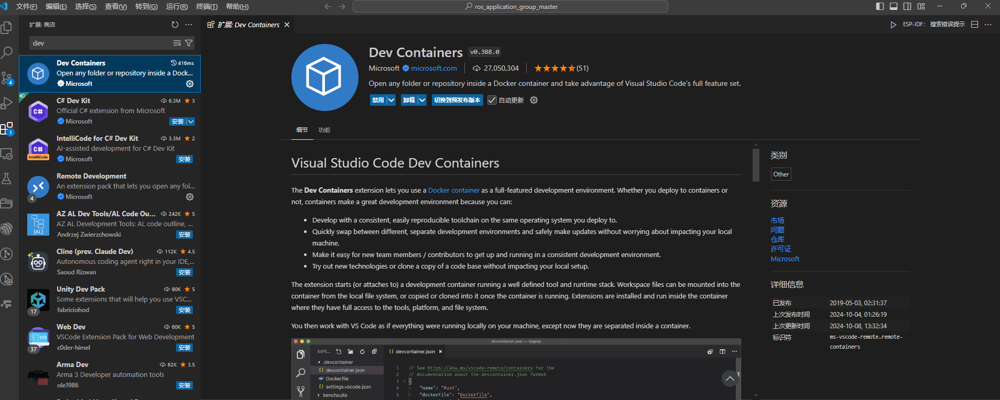
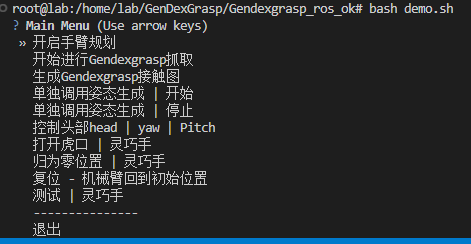

# How to start GenDexGrasp Docker container

# 环境准备
## 第一步，下载docker image
### （1）首先，确保您的宿主机器（默认安装系统为Ubuntu20.04/22.04）上已经安装了docker。
* 安装参考链接: [docker-ubuntu安装](https://vuepress.mirror.docker-practice.com/install/ubuntu/#%E5%AE%89%E8%A3%85-docker)

### （2）接下来docker pull下载默认的镜像
```bash
docker pull kkxiaokang1234/kuavo-gendexgrasp-dev:v1.0
```

## 第二步，将代码放置在对应的文件夹当中
* 放置于文件夹到你的 $HOME 文件夹下
* 解压文件夹Gendexgrasp_ros_ok.zip
```bash
# 参考文件夹的路径
mkdir $HOME/GenDexGrasp
cd $HOME/GenDexGrasp
unzip Gendexgrasp_ros_ok.zip
```

## 第三步，启动docker脚本，同时完成编译
### （1）启动docker脚本 | 启动容器
```bash
cd $HOME/GenDexGrasp/Gendexgrasp_ros_ok
bash ./start_docker_gendexgrasp.sh
```

### （2）vscode - attach running container
* 这一步的作用是可以在vscode当中连接已经在运行的容器，方便代码编辑及修改
* 

### （3）来到文件夹下 | 直接ros编译build即可
```bash
cd /home/lab/GenDexGrasp/Gendexgrasp_ros_ok
catkin build
```

# 启动案例
## （1）启动ik可视化
```bash
cd /home/lab/GenDexGrasp/Gendexgrasp_ros_ok
source devel/setup.bash

# 启动ik
roslaunch motion_capture_ik visualize.launch visualize:=true robot_version:=4 control_hand_side:=0 send_srv:=0
```

## （2）启动姿态描述框架
```bash
cd /home/lab/GenDexGrasp/Gendexgrasp_ros_ok
source devel/setup.bash

# 启动姿态框架
roslaunch grasp_ik_arm_traj all_in_one.launch
```

## （3）启动机器人
* 仿真启动
```bash
cd /home/lab/GenDexGrasp/Gendexgrasp_ros_ok
source devel/setup.bash

# 启动机器人
rosrun dynamic_biped highlyDynamicRobot_node --log_lcm
```
* 实物启动（请连接机器人对应的nuc，同时完成机器人架子的半身编译）
```bash
cd /home/lab/kuavo_ros_ws/
source devel/setup.bash

# 启动实物机器人
## 设置4代机器人手部零点
cd /home/lab/kuavo_ros_ws/src/kuavo_opensource/lib/ruiwo_controller
sudo ./Setzero.sh

## 实物启动机器人
### 如果没编译，请执行
catkin_make -DONLY_USE_HALF_UP_BODY=ON
cd /home/lab/kuavo_ros_ws/
rosrun dynamic_biped highlyDynamicRobot_node --real --log_lcm
```

## （4）启动演示脚本
```bash
# 启动演示脚本
cd /home/lab/GenDexGrasp/Gendexgrasp_ros_ok/scripts
python3 demo_offline.py
```
* then you can see the choice in the terimnal, choose the demo you want to run.
* 