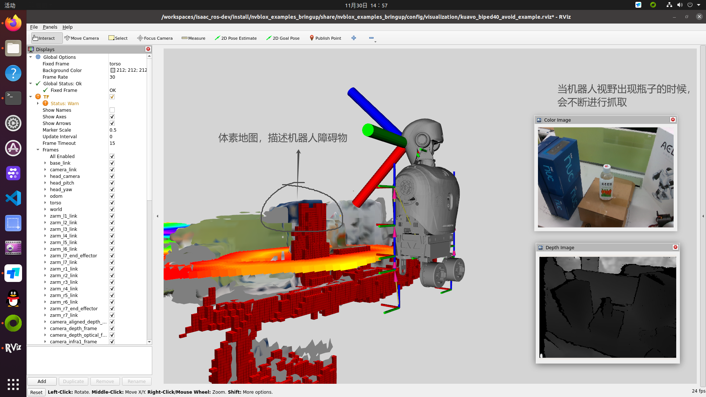

# isaac_ros_kuavo避障轨迹生成运行手册
* 请确保已经按照`isaac_ros_docker更新指南`进行了docker 避障环境机器人轨迹生成的环境配置
* 为了简述描述，下面的docker环境对应如下
```bash
# cuMotion避障轨迹 - docker
kkxiaokang1234/isaac_ros_dev-x86_64    latest    0281994f882c   3 weeks ago   30.7GB
isaac_ros_dev-x86_64                   latest    0281994f882c   3 weeks ago   30.7GB

# Gendexgrasp抓取物体 - docker
kkxiaokang1234/kuavo-gendexgrasp-dev   v1.0      f342da536b38   4 weeks ago   36GB
```

## 环境准备
### 进入到`Gendexgrasp抓取物体`docker环境当中
```bash
cd /home/lab/GenDexGrasp/Gendexgrasp_ros_ok
./start_docker_gendexgrasp.sh
```
#### （1）编译docker环境内的ros1功能包
```bash
cd /home/lab/GenDexGrasp/curobot_ros_ws/bridge_ws/ros1_msgs_ws
sros1
catkin_make_isolated
```
#### （2）编译docker环境内的ros2功能包
```bash
cd /home/lab/GenDexGrasp/curobot_ros_ws/bridge_ws/ros2_msgs_ws
sros2
colcon build
```
#### （3）编译docker环境内的ros1_bridge功能包
```bash
# 编译桥接功能包
cd /home/lab/GenDexGrasp/curobot_ros_ws/bridge_ws/ros2_bridge_ws
sros1
sros2
source /home/lab/GenDexGrasp/curobot_ros_ws/bridge_ws/ros1_msgs_ws/devel_isolated/setup.bash
source /home/lab/GenDexGrasp/curobot_ros_ws/bridge_ws/ros2_msgs_ws/install/setup.bash
colcon build --packages-select ros1_bridge --cmake-force-configure
ros2 run ros1_bridge dynamic_bridge --print-pairs # 打印查看成功桥接的自定义类型
```
#### （4）修改镜像内的view_d435_model.launch相机坐标系TF发布文件 launch文件
```bash
vim /opt/ros/noetic/share/realsense2_description/launch/view_d435_model.launch 
```
* 把rviz节点进行注释，降低cpu占用率
```yaml
<launch>
    <param name="robot_description" command="$(find xacro)/xacro --inorder '$(find realsense2_description)/urdf/test_d435_camera.urdf.xacro' use_nominal_extrinsics:=true add_plug:=true use_mesh:=true" />
    <node name="robot_state_publisher" pkg="robot_state_publisher" type="robot_state_publisher" />

    <arg name="gui" default="True" />
    <param name="use_gui" value="$(arg gui)" />
   <!-- <node name="camera_rviz" pkg="rviz" type="rviz" args="-d $(find realsense2_description)/rviz/urdf.rviz" required="true" /> -->
</launch>
```

#### （5） 修改镜像中的`test_d435_camera.urdf.xacro`由 `base_link` 为 `camera_base_link`
* /opt/ros/noetic/share/realsense2_description/urdf/test_d435_camera.urdf.xacro
```yaml
<?xml version="1.0"?>
<robot name="realsense2_camera" xmlns:xacro="http://ros.org/wiki/xacro">
  <xacro:arg name="use_nominal_extrinsics" default="false"/>
  <xacro:arg name="add_plug" default="false" />
  <xacro:arg name="use_mesh" default="true" />
  <xacro:include filename="$(find realsense2_description)/urdf/_d435.urdf.xacro" />
  
  <link name="base_link" />
  <xacro:sensor_d435 parent="base_link" use_nominal_extrinsics="$(arg use_nominal_extrinsics)" add_plug="$(arg add_plug)" use_mesh="$(arg use_mesh)">
    <origin xyz="0 0 0" rpy="0 0 0"/>
  </xacro:sensor_d435>
</robot>

```
* 修改为以下内容
```yaml
<?xml version="1.0"?>
<robot name="realsense2_camera" xmlns:xacro="http://ros.org/wiki/xacro">
  <xacro:arg name="use_nominal_extrinsics" default="false"/>
  <xacro:arg name="add_plug" default="false" />
  <xacro:arg name="use_mesh" default="true" />
  <xacro:include filename="$(find realsense2_description)/urdf/_d435.urdf.xacro" />
  
  <link name="camera_base_link" />
  <xacro:sensor_d435 parent="camera_base_link" use_nominal_extrinsics="$(arg use_nominal_extrinsics)" add_plug="$(arg add_plug)" use_mesh="$(arg use_mesh)">
    <origin xyz="0 0 0" rpy="0 0 0"/>
  </xacro:sensor_d435>
</robot>
```

### 进入到`cuMotion避障轨迹 `docker环境当中 修改相机发布功能包的功能
```bash
cd ${ISAAC_ROS_WS}/src/isaac_ros_common  # 进入到isaac_ros_common目录
./scripts/run_dev.sh --skip_image_build  # 跳过基础镜像构建
```


### 修改完毕后，您可以通过docker commit命令将此修改保存，不用每次启动docker都更新一遍该配置

---

## 启动
### 进入到`cuMotion避障轨迹 `docker环境当中
#### （1）【如果需要】姿态估计功能包启动 | 如果不需要物体姿态估计直接跳过
```bash
source /workspaces/isaac_ros-dev/install/setup.bash

ros2 launch isaac_ros_examples isaac_ros_examples.launch.py launch_fragments:=realsense_mono_rect_depth,foundationpose mesh_file_path:=${ISAAC_ROS_WS}/isaac_ros_assets/isaac_ros_foundationpose/Mac_and_cheese_0_1/Mac_and_cheese_0_1.obj texture_path:=${ISAAC_ROS_WS}/isaac_ros_assets/isaac_ros_foundationpose/Mac_and_cheese_0_1/materials/textures/baked_mesh_tex0.png score_engine_file_path:=${ISAAC_ROS_WS}/isaac_ros_assets/models/foundationpose/score_trt_engine.plan refine_engine_file_path:=${ISAAC_ROS_WS}/isaac_ros_assets/models/foundationpose/refine_trt_engine.plan rt_detr_engine_file_path:=${ISAAC_ROS_WS}/isaac_ros_assets/models/synthetica_detr/sdetr_grasp.plan
```

#### （2）启动nvblox_moveit功能构建障碍地图 | 根据是否使用姿态估计添加参数
```bash
source /workspaces/isaac_ros-dev/install/setup.bash

ros2 launch biped_s42_cumotion nvblox_moveit_server.launch.py use_foundation_pose:=true  # 使用foundations pose识别抓取物体 | foundation启动相机+图像转发给nvblox

ros2 launch biped_s42_cumotion nvblox_moveit_server.launch.py use_foundation_pose:=false # 不使用foundations pose识别抓取物体 | nvblox节点启动相机
```

#### （3）启动cuMotion避障功能
```bash
source /workspaces/isaac_ros-dev/install/setup.bash

ros2 launch biped_s42_cumotion kuavo_cuMotion.launch.py
```

### 进入到`Gendexgrasp抓取物体`docker环境当中
#### （1）桥接功能包 | 相机坐标发布器
```bash
source /home/lab/GenDexGrasp/Gendexgrasp_ros_ok/devel/setup.bash

roslaunch grasp_ik_arm_traj robot_arm_catch_demo.launch
```
#### （2）启动抓取目标ik抓取解算
```bash
source /home/lab/GenDexGrasp/Gendexgrasp_ros_ok/devel/setup.bash

roslaunch motion_capture_ik visualize.launch visualize:=false robot_version:=4 control_hand_side:=0 send_srv:=0
```
#### （3）启动抓取物体交互功能
```bash
source /home/lab/GenDexGrasp/Gendexgrasp_ros_ok/devel/setup.bash

roslaunch grasp_ik_arm_traj all_in_one.launch

roslaunch grasp_ik_arm_traj all_in_one.launch use_nvidia_foundation:=false use_cumotion_traj:=false # 没有姿态估计，不带避障（识别yolo）

roslaunch grasp_ik_arm_traj all_in_one.launch use_nvidia_foundation:=false use_cumotion_traj:=true  # 没有姿态估计，带避障(识别yolo)

roslaunch grasp_ik_arm_traj all_in_one.launch use_nvidia_foundation:=true use_cumotion_traj:=true   # 添加姿态估计，带避障（识别foundationpose）
```

### 运行最终demo程序
* 当机器人的视野当中出现瓶子的时候，会调用避障抓取功能
* 
```bash
source /home/lab/GenDexGrasp/Gendexgrasp_ros_ok/devel/setup.bash

cd /home/lab/GenDexGrasp/Gendexgrasp_ros_ok/scripts_avoidance

python3 demo_offline_arm_target_sync_cycle.py
```

### 下载kuavo-ros-control docker
```bash
https://kuavo.lejurobot.com/docker_images/kuavo_opensource_ocs2_mpc_wbc_img_0_3.tar
```