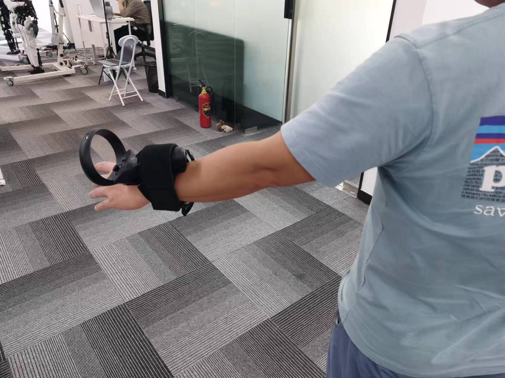
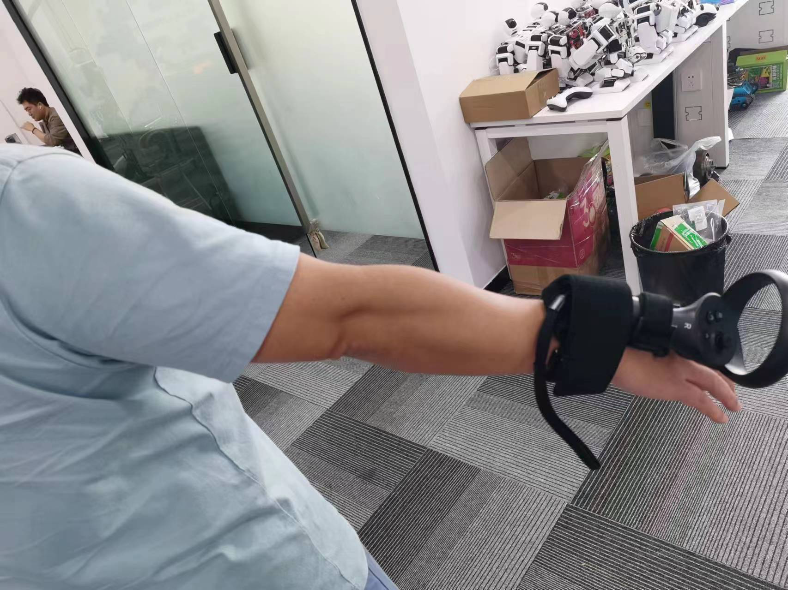
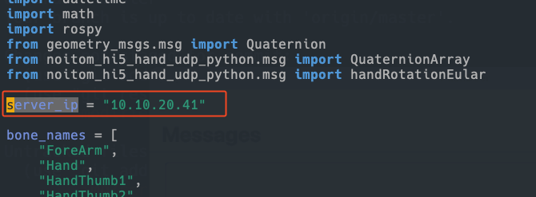
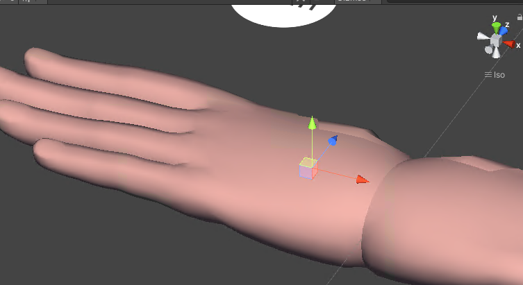
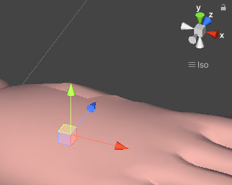

# 手套的基本使用

## 手柄的绑定方向和朝向

请看以下三张图






请注意手柄需要在手套传感器的校正的时候就绑好，否则在校正之后手柄的位置会不正确。

## 连接接收器
将手套的接收器连接至 HTC Vive Focus 3 的 Type-C 接口。

## 安装传感器
将所有传感器安装至手套内。每个传感器侧面标有对应的关节名称，安装时需确保位置正确，且区分左右手。

## 传感器上电
- 将所有传感器放入充电底座。
- 连接充电底座至充电器，并等待 3 秒。
- 断开充电底座与充电器的连接，完成上电。

## 切换通信信道
传感器顶部的圆形按钮用于切换无线通信信道。双击按钮切换信道，信道变更后，传感器灯光颜色会改变，每种颜色代表不同的信道。所有传感器需设置为相同信道以保证通信。默认信道为蓝色，若信道设置错误，重新上电可重置至默认设置。

## 校正过程
- 穿戴手套并启动 HTC 设备。
- 使用 HTC 手柄启动传感器读取程序。
- 确认所有传感器均被正确识别，包括型号和电量。
- 在 VR 界面中，使用头戴设备选择菜单项。
- 若有问题，请回到第一步重新检查。
- 使用头戴设备选择“校准”选项，并按照指示调整手部位置完成校正。校正后，可在虚拟空间中看到手指和手掌的虚拟姿态。

## 启动 ROS 节点
在启动前，需将节点配置文件中的 IP 地址修改为 HTC 设备的实际 IP 地址。之后，通过 ROS 节点的 topic 读取手套姿态数据。代码中的变量名为 `server_ip`



# 参数说明
确保 HTC Vive Focus 3 和使用的电脑位于同一局域网内，并获取 HTC 设备的 IP 地址。使用 UDP 协议，端口配置为 9019（左手）和 9020（右手）。

# 获取 HTC Vive Focus 3 IP 的方法
将 HTC 设备连接至与电脑或机器人相同的 Wi-Fi 网络。参考视频教程。

方法一: 通过路由器管理界面查看设备 IP（具体方法请根据路由器型号查询）。
方法二: 在 HTC 设备设置菜单中，选择“常规” -> “关于” -> “头戴式设备状态”查看 IP 地址。

# 启动节点

在启动节点前，请确保已将`noitom_hand_publish.py`脚本中的`server_ip`变量修改为 HTC 设备的实际 IP 地址。

```sh
rosrun noitom_hi5_hand_udp_python noitom_hand_publish.py
```

# 关节信息说明

所有的关节在 `scripts/noitom_hand_publish.py` 里面的 bone_names 定义， 手部的朝向和位置请使用以下两个关节，朝向的单位为角度，Pos 的单位为米

`
"HandRot",
"HandPos"
`

## 关节坐标系说明

### 左手

以下是左手关节的坐标系，所有关节的朝向都是图中的坐标系



### 右手

以下是右手关节的坐标系，所有关节的朝向都是图中的坐标系




# 资源文件列表

1. 安装到 HTC VIVA focus3 上的 apk 文件：`./assets/noitom.apk` ，把 HTC VIVA Focus3 的开发者模式打开之后，通过 usb 线连接电脑，通过 adb 程序用 `adb install {apk 的文件路径}` 来安装。安装之后带上头戴显示器就能在里面看到安装好的文件

# 其他

## 常见问题

1. 如果手套校正之后还是不能在 VR 里面正确查看到手套的姿势。请带上头戴显示器观察状态菜单里面每个传感器的信号，磁力效果，电池电量。尽量都是绿色，中间那一列代表磁力的如果是橙色说明可能是电机启动，有一定影响但是不大。如果出现红色就代表影响很大，不能使用。

  1.1 如果还不能正确识别，可以把接收器从 HTC 头戴显示器上拔下来重新插上，再进行一次校正。实在还不不行就按住 HTC 后面的电源键关机重新开机试试。

2. 使用的头戴设备的型号 HTC VIVA Focus3 https://www.vive.com/us/product/vive-focus3/overview/
